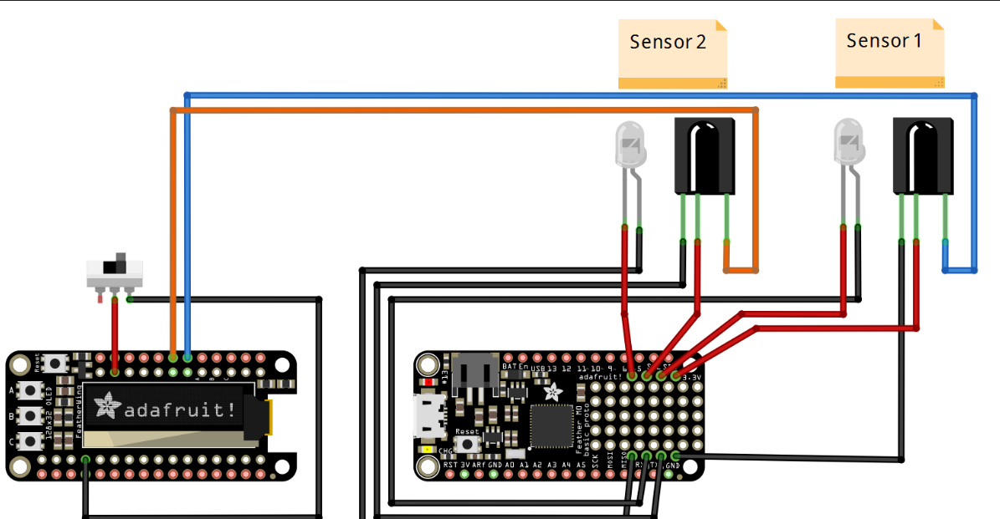
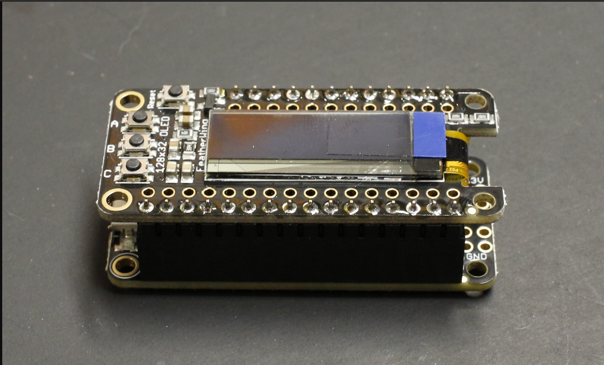

##Project Description

Main goal of this project to find speed of toy car 

##Author 
*Akhmatzhanov Beknazar

For power we will be using the 3.3v connections on the proto section. The ground will be connected the GND connections on the proto also.

The transmitters just need power and ground. For the receivers they will also need a signal wire. For Sensor 1 we will use pin 10, Sensor 2 will use pin 11

Feather M0
##Parts needed
Feather M0 Basic Proto

FeatherWing OLED

Feather Header Kit

2x IR Break Beam Sensor 3mm

Breadboard-friendly SPDT Slide Switch

Lithium-Ion Polymer Battery (optional)

[Project at Thingverse](https://www.thingiverse.com/thing:4028005)

[Youtube video](https://www.youtube.com/watch?v=EXlDcKeUq14)

